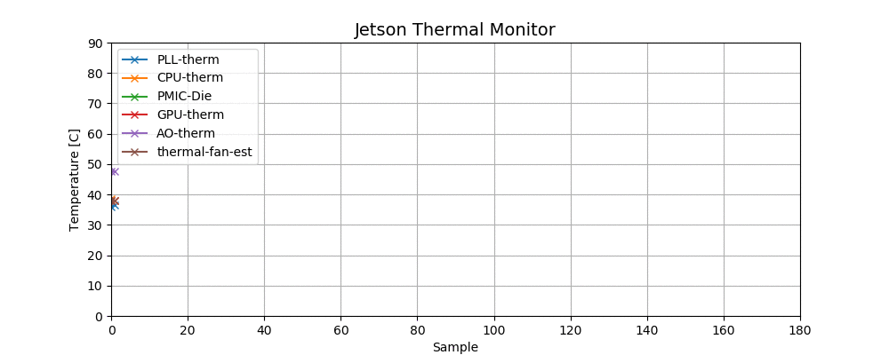

# jetson-thermal-monitor
Real-time plot of temperatures from NVIDIA Jetson on-module thermal sensors



# Usage
```
$ python3 jetson_temp_monitor.py
```

# Notes
- This script is tested on NVIDIA Jetson Nano Developer Kit only.
